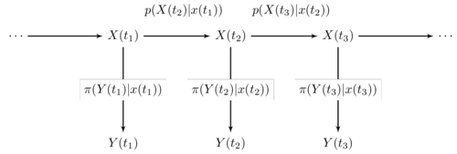

```{r setup, include=FALSE, echo=FALSE}
# setwd("~/Documents/Study/PhD/scalable-bayesian-modelling-of-uo-data/Presentation/ScalableSeminar/")
packages <- c("tidyverse", "gridExtra", "magrittr", "scales", "leaflet")
newPackages <- packages[!(packages %in% as.character(installed.packages()[,"Package"]))]
if(length(newPackages)) install.packages(newPackages)
lapply(packages,require,character.only=T)

theme_set(theme_minimal())
```

## Motivation: Online Inference for Streaming Data

### Starting Point
* Learn about processes which evolve in time
* Make predictions about future observations
* Interpolate missing data

### Next Steps
* Model different related processes

## The Urban Observatory
<div class="notes">
* Streaming data is an unbounded time series
* Urban Observatory provides many related streaming data sources
</div>

```{r, echo=FALSE, warning=FALSE, message=FALSE, fig.align='center'}
locations = read_csv("locations.csv")

## Output a leaflet map of sensor locations
## Remove misspecified sensor locations (with lat & lon = 0.0)
leaflet(locations %>% 
  filter(latitude != 0.0)) %>%
  addTiles() %>%
  addMarkers(~longitude, ~latitude, popup = ~ paste(name, reading, sep = "\n"))
```

## Streaming Data from the Urban Observatory

* Streaming data is typically heterogeneous and irregularly observed
* Dynamic Linear Models have support for missing data but can't easily support irregularly observed data

```{r, echo=FALSE, results='asis', warning=FALSE, message=FALSE}
one_sensor = read_csv("sensor_data.csv")

## Plot some streaming data, show that it is irregularly observed
one_sensor[-c(1:100),] %>%
  distinct() %>%
  select(-theme) %>%
  mutate(value = round(value, 1)) %>%
  spread(reading, value) %>%
  top_n(5, timestamp) %>%
  select(-sensor_name, -lon, -lat) %>%
  knitr::kable()
```

## Univariate Online Analysis: POMP Model

<div align="center"></div>

> - $X_1,X_2,\dots,X_k,\dots$ is a markov process, represented by a diffusion process
> - The diffusion process can be simulated at irregular intervals
> - $Y_k$ only depends on $X_k$ via an observation distribution, $Y_k \sim \pi(Y_k | X_k = x_k)$
> - The observation distribution is flexible

## Inference for POMP Models

> - Determine the state, $X_1,\dots,X_k$, given observations, $y_1,\dots,y_k$
> - Batch algorithms, such as MCMC determine the joint posterior, $p(X_1,\dots,X_k|y_1,\dots,y_k)$
> - If a new observation arrives at time $t = k+1$, the MCMC must be re-run

## Scalable Inference for POMP Models

> - Sequential Monte Carlo (SMC) methods are scalable:
> - The posterior $p(X_k|y_1,\dots,y_k)$ is represented by a collection of particles
> - This posterior can be used to calculate $p(X_{k+1}|y_1,\dots,y_k,y_{k+1})$

> - <div align="center"></div>
  
## Online Parameter Inference

> - Lui and West Algorithm
> - Storvik Algorithm
> - Particle Learning

# Modelling Related Processes

## Humidity and Temperature

```{r, echo=FALSE, message=FALSE, warning=FALSE, fig.align='center'}
one_sensor %>%
  filter(reading %in% c("Humidity", "Temperature")) %>%
  ggplot(aes(x = timestamp, y = value)) +
  geom_line() +
  scale_x_datetime(labels = date_format("%a %d %m")) +
  facet_wrap(~reading, ncol = 1, scales = "free_y")
```

## SUTSE: Seamingly Unrelated Time Series

$$\begin{align*}
\textbf{Y}(t_i)|\textbf{x}(t_i)) &\sim \pi(\textbf{Y}(t_i)|\textbf{x}(t_i)) \\
\textbf{X}(t_i) | \textbf{x}(t_{i-1}) &\sim p(\textbf{X}(t_i) | \textbf{x}(t_{i-1}))
\end{align*}$$

> - A single observation at time $t$ is now a vector with $k$ components, $\textbf{Y}(t_i) = (Y_1(t_i), \dots, Y_k(t_i))^T$
> - The observation distribution is now multivariate
> - Dependence between time series can be induced by having non-diagonal observation variance-covariance matrices

## Summary

* Extend POMP models to multivariate (heterogeneous) observations
* Scalable, online inference for multivariate POMP models

